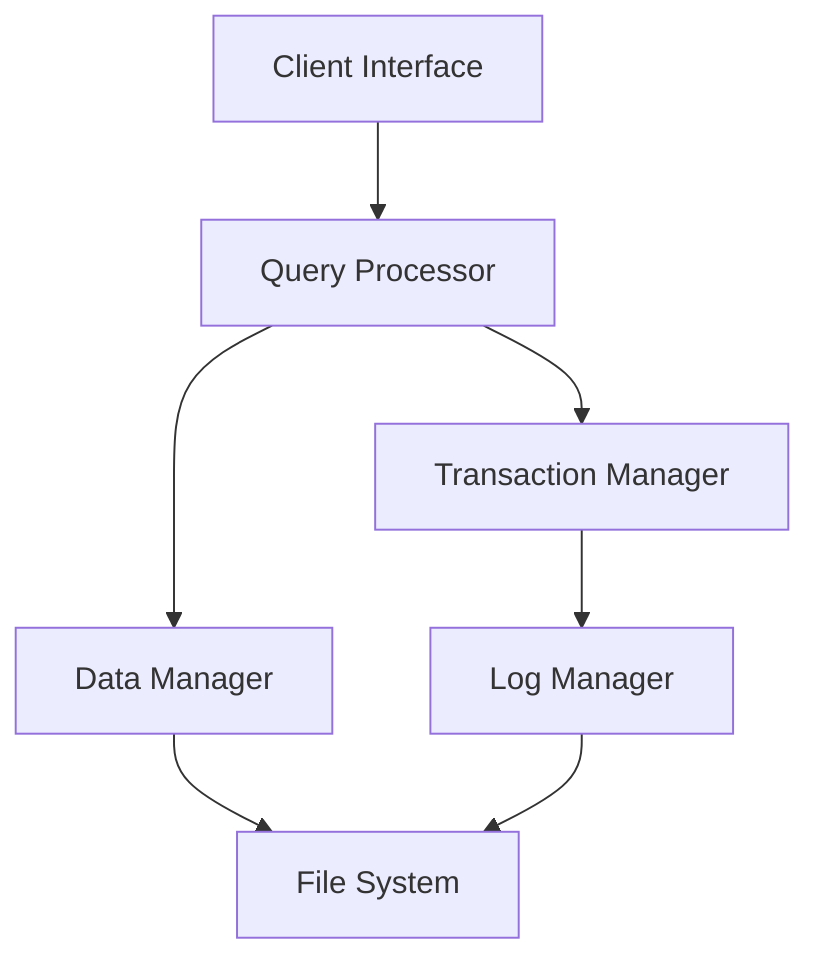

# 🗄️ TinyDB


## 📋 Table of Contents
- [Overview](#overview)
- [Key Features](#key-features)
- [System Architecture](#system-architecture)
- [Getting Started](#getting-started)
- [Usage Guide](#usage-guide)
- [Advanced Features](#advanced-features)
- [Project Structure](#project-structure)
- [Development Team](#development-team)

## 🔍 Overview
TinyDB is a robust, Java-based database management system designed for educational purposes. It implements core DBMS functionalities including DDL/DML operations, ACID-compliant transactions, and comprehensive logging systems.

## ⭐ Key Features

### 🛡️ Security & Authentication
- User registration with secure profile management
- Password-based authentication
- Security question implementation
- Session management

### 💽 Core Database Operations
#### DDL (Data Definition Language)
- Database creation and management
- Table schema definition
- Table modification and deletion
- Database export capabilities

#### DML (Data Manipulation Language)
- Record insertion (`INSERT`)
- Data updates (`UPDATE`)
- Record deletion (`DELETE`)
- Data querying (`SELECT`)
- WHERE clause support for filtering

### 🔄 Transaction Management
- **ACID Compliance:**
  - Atomicity
  - Consistency
  - Isolation
  - Durability
- Transaction commands:
  ```sql
  BEGIN TRANSACTION;
  -- Your SQL commands here
  COMMIT;
  -- or
  ROLLBACK;
  ```
- Automatic rollback on failures
- Transaction buffer management

### 📊 Data Export System
- SQL format export
- Complete schema export
- Data preservation
- Example usage:
  ```sql
  EXPORT DATABASE database_name;
  ```

### 📝 Comprehensive Logging
```json
{
  "user_activity": "logs/user_activity_log.json",
  "queries": "logs/query_log.json",
  "transactions": "logs/transaction_log.json",
  "events": "logs/event_log.json",
  "general": "logs/general_log.json"
}
```

## 🏗️ System Architecture



## 🚀 Getting Started

### Prerequisites
- Java JDK 8 or higher
- Minimum 512MB RAM
- 1GB free disk space

### Installation
1. Clone the repository:
   ```bash
   git clone https://git.cs.dal.ca/mkalathiya/tinydb.git
   ```
2. Navigate to project directory:
   ```bash
   cd tinydb
   ```
3. Compile the project:
   ```bash
   javac src/*.java -d bin/
   ```
4. Run TinyDB:
   ```bash
   java -cp bin/ TinyDB
   ```

## 📖 Usage Guide

### Basic Database Operations
```sql
-- Create a new database
CREATE DATABASE employees_db;

-- Use the database
USE employees_db;

-- Create a table
CREATE TABLE employees (
    id INT,
    name STRING,
    department STRING,
    salary INT
);

-- Insert data
INSERT INTO employees (id, name, department, salary) 
VALUES (1, 'John Doe', 'Engineering', 75000);

-- Query data
SELECT * FROM employees WHERE department = 'Engineering';
```

### Transaction Example
```sql
BEGIN TRANSACTION;
    INSERT INTO employees VALUES (2, 'Jane Smith', 'HR', 65000);
    UPDATE employees SET salary = 70000 WHERE id = 2;
    DELETE FROM employees WHERE id = 1;
COMMIT;
```

## 📁 Project Structure
```
tinydb/
├── src/
│   ├── main/
│   │   ├── DatabaseManager.java
│   │   ├── TransactionManager.java
│   │   ├── LogManager.java
│   │   └── ExportManager.java
│   └── test/
├── databases/
├── logs/
└── docs/
```


## 📫 Contact & Support
- **GitLab Repository:** [TinyDB Project](https://git.cs.dal.ca/mkalathiya/tinydb)
- **Documentation:** Available in `docs/` directory


